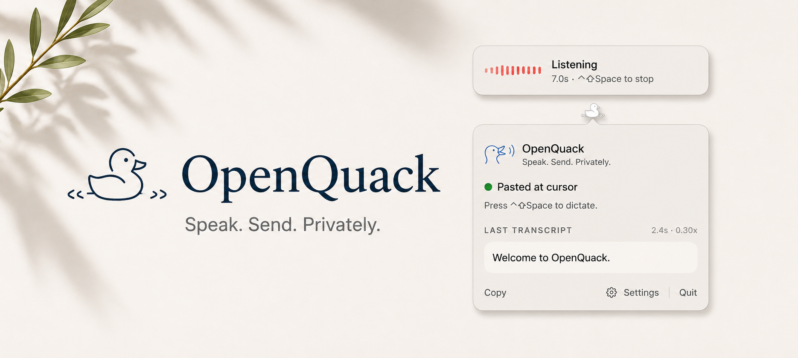

<p align="center">
  
</p>

<div align="center">

**OpenQuack** *Speak. Send. Privately.*

Voice dictation for macOS. Nothing leaves your device — audio, text, nothing.

[](LICENSE)
[](docs/INSTALL.md)
[](docs/ROADMAP.md)

</div>

---

## What it is

OpenQuack is a tiny menu-bar app for macOS. Press a hotkey, speak, press it again — your transcript appears at the cursor. Wherever you can type, you can talk.

Speech recognition happens on your Mac. No cloud, no account, no signup, no telemetry.

## Why

**Local.** Everything runs on your device — recording, transcription, optional polish. Nothing leaves: no audio, no text, no telemetry, no signup. Confidential work stays confidential, by construction. And because there's no API call in the loop, it just keeps working — offline, on a plane, behind a corporate firewall.

**Fast.** Whisper on Apple Silicon transcribes in roughly a fifth of the time you spent speaking. ~2.6% word-error rate on real human speech on a baseline M4 / 16 GB. Faster than typing in most cases. Full bench matrix in [`docs/BENCHMARKS.md`](docs/BENCHMARKS.md).

**Open.** MIT-licensed. Every line is auditable; every change happens in public. The version running in your menu bar is the version in this repo.

## What you get

- **One-key dictation.** Pick a hotkey (default ⌃⇧Space). Toggle or push-to-talk.
- **All local.** Speech recognition runs on your Mac. No internet needed for dictation — works offline, on a plane, in a tunnel, behind a corporate firewall. No API keys, no rate limits, no service outages. Same dictation in personal or business settings.
- **Multi-language.** Whisper handles 99 languages — English, Chinese, Japanese, Korean, Spanish, French, German, Italian, and Portuguese are right in Settings; auto-detect on by default.
- **Auto-paste at the cursor** in any app. (Falls back to your clipboard if you'd rather paste yourself.)
- **Smart formatting** — capitalisation, end-punctuation, "um/uh" cleanup.
- **Custom dictionary** — teach it the proper nouns and project names you actually use.
- **Auto-stop after silence.** Finish speaking, OpenQuack wraps up on its own.
- **Live mic-level overlay** so you can see it's listening.
- **Quick first-launch setup** — permissions, hotkey, done in a minute.
- **Tiny.** An 8 MB menu-bar app, plus the speech model on first run.
- **Open source**, MIT.

## Privacy, in one screen

1. **Nothing leaves your device — audio, text, nothing.** Recording and transcription are fully local. Always.
2. **No analytics, no telemetry, no signup.**

The full privacy contract is in [`docs/VISION.md`](docs/VISION.md#privacy-contract).

## Coming next

A peek at what's queued up. Both build on the dictation foundation that ships today.

**In-context transcription.** OpenQuack will read the surrounding text where you're about to paste — the line above the cursor, the function you're inside, the chat thread you're replying to — and feed it to the speech model as context. Domain terms get disambiguated by what you're actually doing ("cloud code" turns into "Claude Code" when you're in a terminal, not the other way around). Less custom-dictionary tinkering needed.

**Thinking mode.** A second pass after transcription, run through a small local LLM, that turns a raw spoken sentence into a written one you'd actually press send on. Filler trimmed, structure tightened, the right capitalisation on words that matter. Off by default, one-toggle opt-in. Fully local — Ollama or MLX-LM, your pick.

Schedule and SPEC details in [`docs/ROADMAP.md`](docs/ROADMAP.md).

The duck has bigger plans. Where this is going: [`docs/VISION.md`](docs/VISION.md).

## Install

```sh
brew tap larryxiao/openquack https://github.com/larryxiao/openquack
brew install --cask openquack
```

Or [download the DMG](https://github.com/larryxiao/openquack/releases) and drag into Applications. First launch: right-click → **Open** → **Open** (one-time Gatekeeper bypass).

Grant **Microphone** when macOS asks, pick a hotkey in **Settings → Shortcut** (default ⌃⇧Space).

Want a guided walkthrough? See [`docs/TUTORIAL.md`](docs/TUTORIAL.md) — five minutes from install to first dictation.

### Or tell your AI agent

Paste this into Claude Code, Codex, opencode, Hermes, or similar:

```text
Install OpenQuack on this Mac:

  brew tap larryxiao/openquack https://github.com/larryxiao/openquack
  brew install --cask openquack

(Or grab the DMG from https://github.com/larryxiao/openquack/releases
and drag it into /Applications; first open right-click → Open → Open.)

Then launch /Applications/OpenQuack.app, grant Microphone, and pick a
hotkey in Settings → Shortcut. Default ⌃⇧Space.
```

More options (uninstall, build-from-source, what's downloaded on first run): [`docs/INSTALL.md`](docs/INSTALL.md).

## Contribute

OpenQuack is **AI-native open source** — every PR cites a SPEC, atomic tasks come from the roadmap, the workflow is friendly to coding agents at scale (and humans on the same path).

Start with [`AGENTS.md`](AGENTS.md), pick a 🔵 task in [`docs/ROADMAP.md`](docs/ROADMAP.md), open a draft PR.

Under the hood: [`TUTORIAL`](docs/TUTORIAL.md) · [`DEVELOPMENT`](docs/DEVELOPMENT.md) · [`ARCHITECTURE`](docs/ARCHITECTURE.md) · [`BENCHMARKS`](docs/BENCHMARKS.md) · [`DESIGN`](docs/DESIGN.md) · [`INSTALL`](docs/INSTALL.md).

## License

MIT — see [LICENSE](LICENSE).
